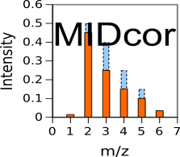
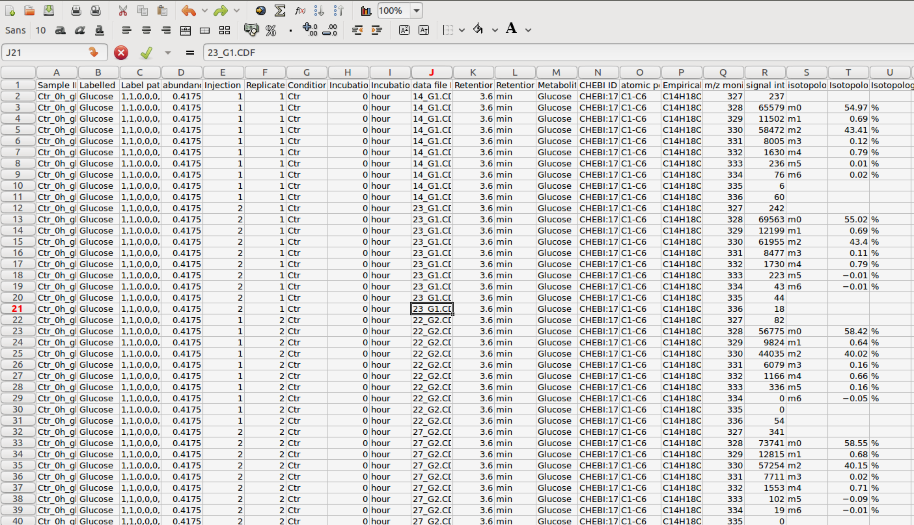

# MIDcor

Version: 1.0

## Short Description

“R”-program that corrects 13C mass isotopomers spectra of metabolites for natural occurring isotopes and peaks overlapping

## Description

“midcor.R” is an “R”-program that performs a primary analysis of isotopic isomers (isotopomers) distribution obtained by Gas Cromatography coupled with Mass Spectrometry (GCMS). The aim of this analysis is to have a correct distribution of isotopes originated from substrates that are artificially enriched with specific isotopes (usually 13C). To this end the program performs a correction for naturally occurring isotopes and also correction for “impurities” of the assay media that give peaks overlapping with the spectra of analyzed labeled metabolites. This program offers two ways of corrections of “impurities” resulted from overlapping the assayed mass isotopomer distribution with peaks produced either by unknown metabolites in the media, or by different fragments produced by the assayed metabolite. The rsult of such a correction is saved using the format convenient for including into the database Metabolights.
<p> In addition to this main functionality Midcor docker container is supplemented by functions that prepare the corrected mass isotopomer distributions (MID) of metabolites for the simulation of MID dynamics with our software Isodyn. These functions transform the format of output file to make it convenient for manual selection of good samples, and, for selected samples, calculate the mean and standard deviation for the peaks of MID. These values are used then for simulation with Isodyn.</p>

## Key features

- primary processing of 13C mass isotopomer data obtained with GCMS

## Functionality

- Preprocessing
- Statistical Analysis
- Workflows

## Approaches

- Isotopic Labelling Analysis / 13C
    
## Instrument Data Types

- MS
- GC-MS

## Data Analysis

- correction for H+ loss produced by electron impact, natural occurring isotopes, and peaks overlapping

## Screenshots

- screenshot of input data (format Metabolights), output is the same format with one more column added: corrected mass spectrum



## Tool Authors

- [Vitaly Selivanov (Universitat de Barcelona)](https://github.com/seliv55)

## Container Contributors

- [Pablo Moreno (EMBL-EBI)](https://github.com/pcm32)

## Website

- N/A

## Git Repository

- https://github.com/seliv55/midcor

## Installation  
  
MIDcor is present on all PhenoMeNal Galaxy instances on deployed Cloud Research Environments, under the Fluxomics category in the tool bar to the left of the screen. No installation is needed hence on PhenoMeNal Cloud Research Environments.

For advanced Docker usage:

- Go to the directory where the dockerfile is.
- Create container from dockerfile:

```
sudo docker build -t midcor:0.3 .
```

Alternatively, pull directly from the repo 

```
docker pull container-registry.phenomenal-h2020.eu/phnmnl/midcor
```


## Usage Instructions

To perform the correction of raw MID using docker image contained in PhenoMeNal registry, execute
 
```
sudo docker run -it -v $PWD:/data container-registry.phenomenal-h2020.eu/phnmnl/midcor -i /data/[input_file] -o /data/[output_file]
```
Here the path to the local current working directory ($PWD) is assigned for the docker image as "/data", [input_file] and [output_file] are paths to the input and output files relative to the $PWD.

To run MIDcor as a docker image created locally:

```
sudo docker run -it -v $PWD:/data midcor:0.3 -i /data/[input_file] -o /data/[output_file] 
```
Three examples of input files are provided in https://github.com/seliv55/midcor. These examples are "ramidout.csv", "cdf2midout.csv", "exam2ou.csv".

- run test1 using the data that are in the file "ramidout.csv" in https://drive.google.com/drive/folders/0B1lAg6jyw6lvSlphUi1mdlUwUXM
 
```
sudo docker run -it --entrypoint=runTest1.sh midcor:0.3 
```
- run test2 using the data that are in the file "cdf2midout.csv" in https://drive.google.com/drive/folders/0B1lAg6jyw6lvSlphUi1mdlUwUXM
 
```
sudo docker run -it --entrypoint=runTest1.sh midcor:0.3 
```
After the correction is done the next two steps should be performed to use isodyn for the subsequent analysis.
1. Reformatting the data for convenient manual selection of good samples
```
sudo docker run -it -v $PWD:/data midcor:0.3 -i /data/[output_file] -c /data/[converted_file] 
```
Here the option "-c" states for converting the obtained in the previous step file [output_file], formatted for Metabolights, into a file [converted_file] for easy visual selection of good samples.
2. Calculating the mean and standard deviations for the peaks of MID in the samples after their manual selection.
```
sudo docker run -it -v $PWD:/data midcor:0.3 -s /data/[converted_file] -d /data/[isodyn_input_file] 
```
Here the option "-s" indicates that the file [converted_file] obtained in the previous step is used for simple statistical calculations to find mean and standard deviations. The program saves these calculations in  [isodyn_input_file], which are used for Isodyn simulations. The option "-d" states for "directory", only the path to the directory (relative to $PWD) should be indicated, the file name the program construct as concatenation of names of cell line and tracer.

On a PhenoMeNal Cloud Research Environment, go to Fluxomics tool category, and then click on midcor, and fill the expected input files, then press Run. Additionally, the tool can be used as part of a workflow with RaMID, Iso2flux and the Escher-Fluxomics tools. On a PhenoMeNal deployed CRE you should find as well a Fluxomics Stationary workflow, which includes MIDcor.

## Publications

- Selivanov VA, Benito A, Miranda A, Aguilar E, Polat IH, Centelles JJ, Jayaraman A, Lee PW, Marin S, Cascante M. MIDcor, an R-program for deciphering
mass interferences in mass spectra of metabolites enriched in stable isotopes. BMC Bioinformatics. 2017, 18:88. doi: 10.1186/s12859-017-1513-3. PubMed
PMID: 28158972.

